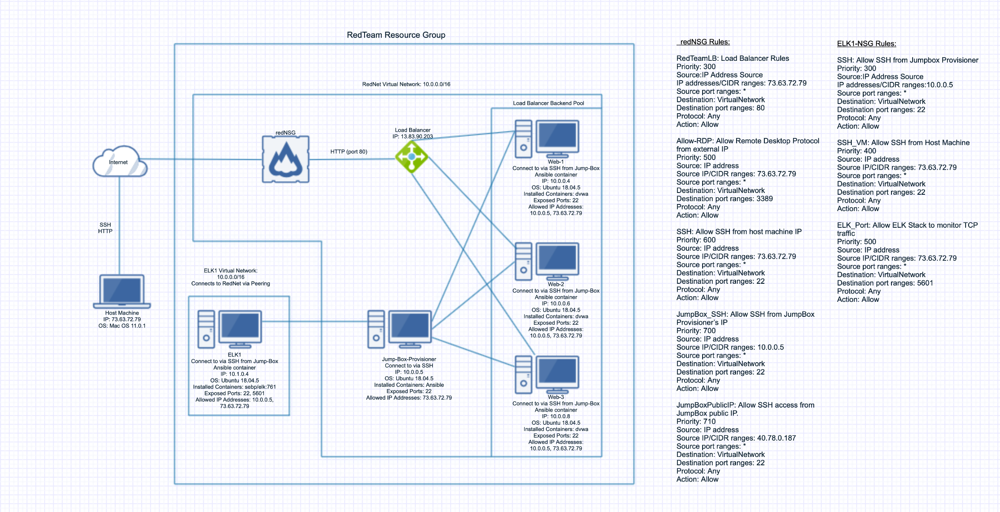
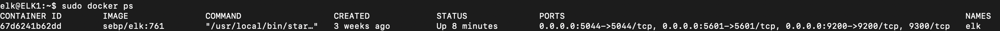

## Automated ELK Stack Deployment

The files in this repository were used to configure the network depicted below.



These files have been tested and used to generate a live ELK deployment on Azure. They can be used to recreate the entire deployment pictured above. Alternatively, select portions of the YAML file may be used to install only certain pieces of it, such as Filebeat.

```
---
- name: Configure Elk VM with Docker
  hosts: elkservers
  remote_user: elk
  become: true
  tasks:
    # Use apt module
    - name: Install docker.io
      apt:
        update_cache: yes
        force_apt_get: yes
        name: docker
        state: present

      # Use apt module
    - name: Install python3-pip
      apt:
        force_apt_get: yes
        name: python3-pip
        state: present

      # Use pip module (It will default to pip3)
    - name: Install Docker module
      pip:
        name: docker
        state: present

      # Use command module
    - name: Increase virtual memory
      command: sysctl -w vm.max_map_count=262144

      # Use sysctl module
    - name: Use more memory
      sysctl:
        name: vm.max_map_count
        value: '262144'
        state: present
        reload: yes

      # Use docker_container module
    - name: download and launch a docker elk container
      docker_container:
        name: elk
        image: sebp/elk:761
        state: started
        restart_policy: always
        # Please list the ports that ELK runs on
        published_ports:
          -  5601:5601
          -  9200:9200
          -  5044:5044
```


### Description of the Topology

The main purpose of this network is to expose a load-balanced and monitored instance of DVWA, the D*mn Vulnerable Web Application.

Load balancing ensures that the application will be highly stable, in addition to restricting access to the network. This ensures consistent and appropriate availability of network resources.

Integrating an ELK server allows users to easily monitor the vulnerable VMs for changes to the file system and system logs.


The configuration details of each machine may be found below:

| Name                | Function       | IP Address | Operating System |
|---------------------|----------------|------------|------------------|
| JumpBox Provisioner | Gateway        | 10.0.0.5   | Ubuntu 18.04.5   |
| Web-1               | DVWA Host      | 10.0.0.4   | Ubuntu 18.04.5   |
| Web-2               | DVWA Host      | 10.0.0.6   | Ubuntu 18.04.5   |
| Web-3               | DVWA Host      | 10.0.0.8   | Ubuntu 18.04.5   |
| ELK1                | ELK Stack Host | 10.1.0.4   | Ubuntu 18.04.5   |

### Access Policies

The machines on the internal network are not exposed to the public Internet. 

Only the Jumpbox Provisioner machine can accept connections from the Internet. Access to this machine is only allowed from the following IP address:

- 73.63.72.79

Machines within the network can only be accessed by the Jumpbox Provisioner.

A summary of the access policies in place can be found in the table below.

| Name                | Publicly Accessible | Allowed IP Addresses |
|---------------------|---------------------|----------------------|
| JumpBox Provisioner | Yes                 | 73.63.72.79          |
| Web-1               | No                  | 10.0.0.5             |
| Web-2               | No                  | 10.0.0.5             |
| Web-3               | No                  | 10.0.0.5             |
| ELK1                | No                  | 10.0.0.5             |

### Elk Configuration

Ansible was used to automate configuration of the ELK machine. No configuration was performed manually, which is advantageous because multiple machines can be configured simultaneously, ensuring consistency and efficiency.

The playbook implements the following tasks:
- Install Docker
- Install Python
- Increase the amount of virtual memory
- Download and launch a Docker ELK container.

The following screenshot displays the result of running `docker ps` after successfully configuring the ELK instance:



### Target Machines & Beats
This ELK server is configured to monitor the following machines:
- 10.0.0.4
- 10.0.0.6
- 10.0.0.8

We have installed the following Beats on these machines:
- FileBeat

FileBeat allows us to collect the following information from each machine:
- FileBeat helps to generate and organize log files, which are sent to Logstash and Elasticsearch. Any changes to the file system are logged, and time/dates are included. 
- It can also be used to collect specific information from various files, such as logs generated by web servers including Apache, Nginx, MySQL, and more.

### Using the Playbook
In order to use the playbook, you will need to have an Ansible control node already configured. Assuming you have such a control node provisioned: 

SSH into the control node and follow the steps below:
- Copy the `install-elk.yml` file to `/etc/ansible/`.
- Update the hosts file to include the IP addresses of machines you wish to run the playbook on. Separate them in groups, labeling the Filebeat machines group `[webservers]` and the ELK server `[elkservers]`.

```[webservers]
## alpha.example.org
## beta.example.org
## 192.168.1.100
## 192.168.1.110
10.0.0.4 ansible_python_interpreter=/usr/bin/python3
10.0.0.6 ansible_python_interpreter=/usr/bin/python3
10.0.0.8 ansible_python_interpreter=/usr/bin/python3

[elkservers]
10.1.0.4 ansible_python_interpreter=/usr/bin/python3
```

- Run the playbook, and navigate to http://52.170.82.3:5601/app/kibana to check that the installation worked as expected.

